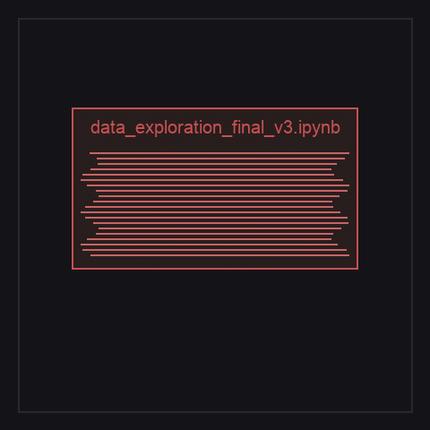
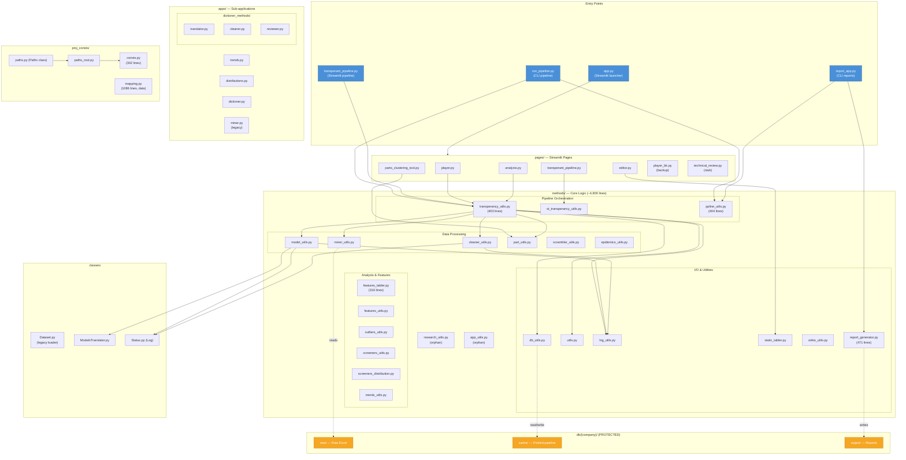
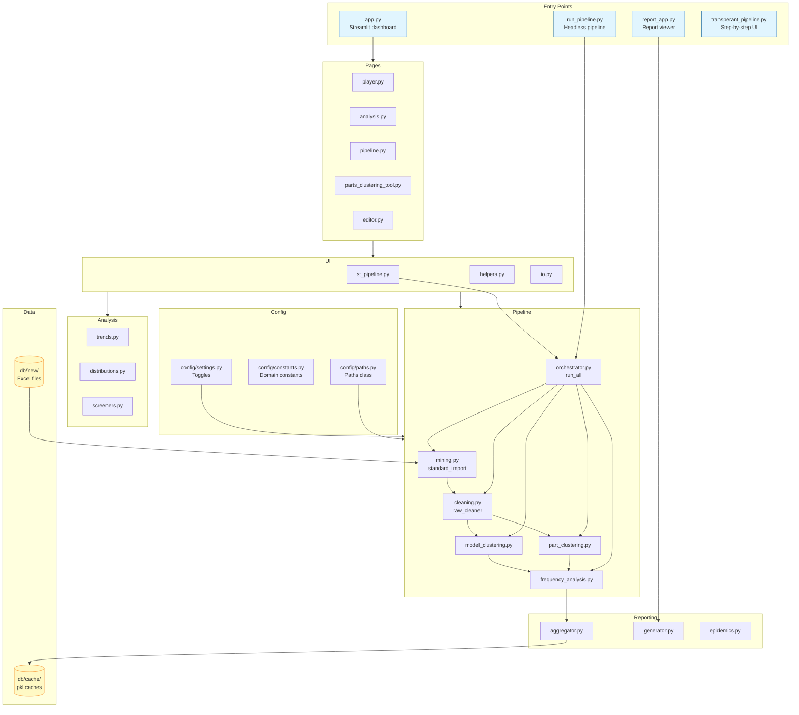
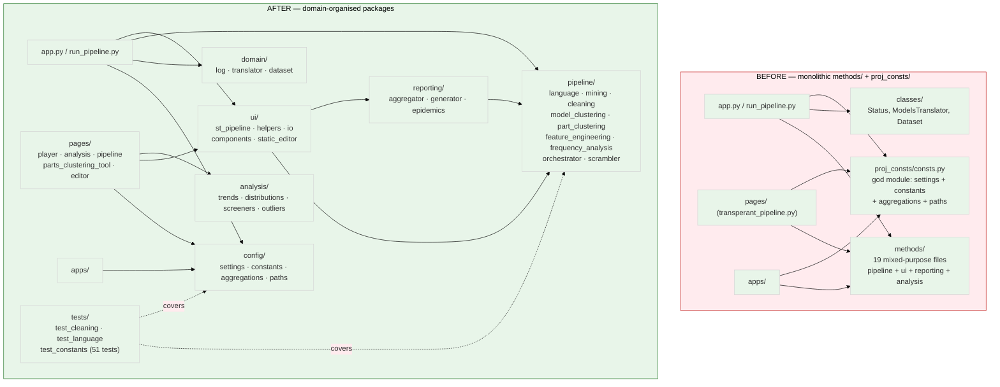

# 🧹 Claudify



**Transform messy, research-style codebases into clean, well-documented repositories optimized for Claude Code workflows.**

LLMs are incredible at coding, but they choke on massive context windows, tangled dependencies, and disorganized "research-style" scripts. Claude Code needs clear boundaries, specific context, and single-responsibility modules to thrive.

**Claudify** is an 8-phase workflow that uses Opus (for planning) and Sonnet (for execution) to dissect, untangle, and restructure your project so AI can actually work with it.

## Quick Start
```bash
npx skills add oristav/claudify
```

## Why use Claudify?
- **Saves Context:** Breaks massive monoliths into digestible modules.
- **Safety First:** Operates on a dedicated branch, confirms read/write paths, and treats data/secrets as untouchable.
- **AI-Native Context:** Generates the perfect `CLAUDE.md` and repository inventory.
- **Builds Confidence:** Generates tests and Mermaid architecture diagrams (before & after).

## The 8 Phases

| Phase | Name | What it does | Model |
|-------|------|--------------|-------|
| 0 | Pre-flight | Audits the codebase, extracts dependencies & diagrams | Opus |
| 1 | Architect | Creates a step-by-step refactoring & module extraction plan | Opus |
| 2 | Refactor | Executes the plan safely via git commits | Sonnet |
| 3 | Cleanup | Removes dead code and empty directories with confirmation | Sonnet |
| 4 | CLAUDE.md | Writes the perfect AI-context guide tailored to the new repo | Sonnet |
| 5 | README.md | Generates human-readable docs with Mermaid architecture | Sonnet |
| 6 | Tests | Scaffolds test structures for the most critical modules | Sonnet |
| 7 | Validation | Runs diffs, checks logic, and proves the refactor worked | Sonnet |

## Outputs - Keep your hands on the wheel
*Saved to the `claudify/` directory.*

- `PLAN.md` — step-by-step work plan
- `PROTECTED_PATHS.md` — list of paths that must not be read or modified
- `INVENTORY.md` — structured snapshot of the codebase
- `DIAGRAMS.md` — architecture diagrams before, after, diff
- `CLEANUP_LOG.md` — log of removed files and directories
- `REFACTOR_LOG.md` — log of refactoring steps
- `CLAUDIFY_REPORT.md` — log of removed files and directories
- `CLAUDE.md` — AI-context guide tailored to the new repo


## Example: Before and After 
*Claudify Architecture Diagrams*

All architecture diagrams for this refactor session. Updated as each phase completes.

---

### Phase 0 — Architecture Before



---

### Phase 5 — Architecture After



---

### Phase 7 — Before vs After Diff



## License
MIT