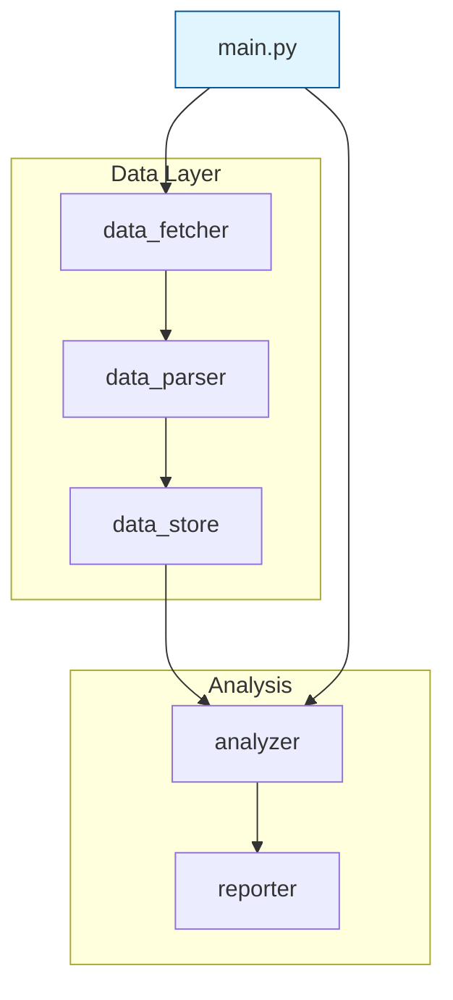

# Phase 5 — README.md with Mermaid Diagrams

## Context

README.md is the human-facing front door to the project. Unlike CLAUDE.md (which
is optimized for Claude Code's context window), README.md is written for humans
browsing the repo on GitHub, onboarding new contributors, or returning after time away.

This phase generates a comprehensive README with Mermaid diagrams that visually
explain the project's architecture and data flow.

## Prerequisites

- Completed Phases 0–4:
  - `INVENTORY.md`
  - `ARCHITECTURE_BEFORE.mermaid`
  - `PLAN.md`
  - `CLAUDE.md`
  - Refactored codebase on `claudify/refactor` branch
- Claude Code session with **Sonnet** model

## Optional skill dependency

If available in the user's Claude Code environment, this phase benefits from:

- **`/mermaid-diagrams`** — Provides best practices for Mermaid diagram creation,
  including syntax patterns, styling conventions, and diagram type selection.
  If available, use it as the guide for all diagram generation in this phase.
  If unavailable, follow the built-in diagram guidelines in the instructions below.

## Instructions

Run the following in Claude Code:

```
Claudify Phase 5: Generate README.md with Mermaid diagrams.

Read CLAUDE.md, PLAN.md (Sections 2 and 8), and ARCHITECTURE_BEFORE.mermaid.
Scan the current codebase structure to reflect the post-refactor state.

If /mermaid-diagrams skill is available, use it for all diagram generation —
it has syntax patterns, styling, and best practices for producing clean,
readable diagrams. If unavailable, follow the built-in guidelines below.

Generate README.md at the project root with these sections:

## 1. Title & badges

- Project name as H1
- One-line description
- Badges if applicable (Python version, license, build status)
  Only include badges that are real and configured — no placeholder badges.

## 2. Overview

2–3 paragraphs explaining:
- What the project does and why it exists
- The core problem it solves
- Who should use it

Write for a human who just landed on this repo. More narrative than CLAUDE.md,
less terse.

## 3. Architecture diagram

Create a Mermaid diagram showing the post-refactor architecture:
- Module groupings as subgraphs
- Data flow between modules (arrows with labels)
- Entry points highlighted
- External dependencies shown as distinct nodes

Embed it directly in the README using a ```mermaid code block.

Also add it as `## Phase 5 — Architecture After` in `claudify/DIAGRAMS.md`.
Do NOT create a separate `.mermaid` file — all diagrams live in `claudify/DIAGRAMS.md`.

### Diagram guidelines (when /mermaid-diagrams is unavailable)

- Use `graph TD` (top-down) for architecture overviews
- Use `flowchart LR` (left-right) for data pipelines and sequential flows
- Use `classDiagram` only if the project is heavily OOP
- Keep it readable: max 15–20 nodes. Collapse utility modules into their parent.
- Use meaningful labels on arrows (not just lines)
- Use subgraph blocks to group related modules
- Style entry points distinctly:
  `style EntryPoint fill:#e1f5fe,stroke:#01579b`
- Avoid crossing arrows where possible — reorder nodes to minimize crossings

Example structure:


## 4. Data flow diagram

If the project processes data through multiple stages (common in research codebases),
create a second Mermaid diagram showing the data pipeline:
- Where data enters (APIs, files, databases)
- Each transformation step
- Where results go (output files, visualizations, APIs)

Use `flowchart LR` for this — left-to-right reads naturally for pipelines.

Skip this section if the project doesn't have a meaningful data flow.

## 5. Installation

Step-by-step setup instructions:
- Prerequisites (language version, system deps)
- Clone command
- Install dependencies (exact commands)
- Configuration (env vars, config files to copy/edit)

Mirror CLAUDE.md Section 4 but write for humans — add brief explanations
of why each step is needed if it's not obvious.

## 6. Usage

How to actually use the project:
- Primary entry points with example commands
- Common workflows with examples
- Expected output (what the user should see)

Include concrete examples, not just API signatures.

## 7. Project structure

A directory tree of the post-refactor layout with one-line descriptions:

```
project/
├── src/
│   ├── data/          # Data fetching and parsing
│   ├── analysis/      # Core analysis modules
│   └── reporting/     # Output generation
├── tests/             # Test suite
├── config/            # Configuration files
├── CLAUDE.md          # Claude Code project context
└── README.md          # This file
```

Keep it high-level — directories and key files only, not every single file.

## 8. Contributing (optional)

If relevant, brief notes on:
- Coding standards (reference zenify or the embedded rules)
- How to run tests
- Branch/PR conventions

Skip if this is a personal/solo project unless the user requests it.

---

## Writing style for README.md

- Write for humans, not for Claude Code
- Use clear, welcoming language — someone new should feel oriented after reading it
- Diagrams should be self-explanatory — if you need a paragraph to explain a diagram,
  the diagram needs simplification
- Don't duplicate CLAUDE.md verbatim — README and CLAUDE.md serve different audiences
- Keep total length reasonable — a README that's longer than the codebase is a red flag

After generating:
1. Save the architecture diagram separately:
   Copy the mermaid block to `ARCHITECTURE_AFTER.mermaid`
2. Commit:
   `git add README.md ARCHITECTURE_AFTER.mermaid && git commit -m "claudify: add README.md with architecture diagrams"`
```

## Success criteria

After this phase completes, verify:

- [ ] `README.md` exists at the project root
- [ ] At least one Mermaid diagram is embedded and renders correctly on GitHub
- [ ] `ARCHITECTURE_AFTER.mermaid` exists as a standalone file
- [ ] The architecture diagram reflects the post-refactor structure (not the original)
- [ ] Installation commands are exact and runnable
- [ ] Usage section has concrete examples
- [ ] Project structure tree matches the actual current layout
- [ ] README doesn't duplicate CLAUDE.md — they serve different audiences
- [ ] Committed on the `claudify/refactor` branch
